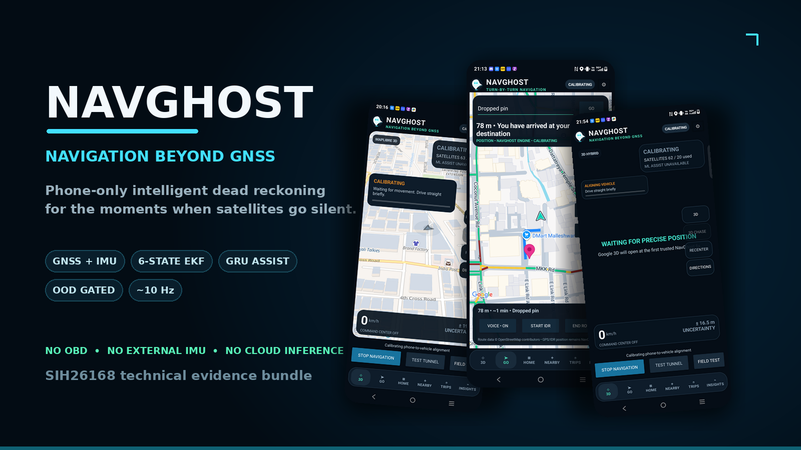
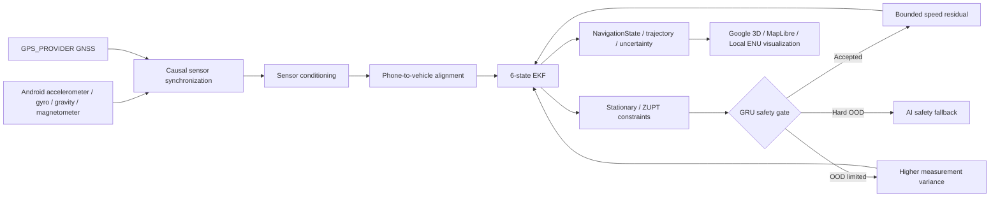

<p align="center">
  
</p>

<p align="center">
  <a href="https://navghost-idr.vercel.app/"><strong>Website</strong></a>
  &nbsp;•&nbsp;
  <a href="https://youtube.com/shorts/dDlNKvobRqo?si=_gFi8ewl1akC1nOQ"><strong>Demo Video</strong></a>
  &nbsp;•&nbsp;
  <a href="https://navghost-idr.vercel.app/downloads/NavGhost-Android-v2.4.0.apk"><strong>Download APK</strong></a>
</p>

<p align="center">
  <a href="#the-idea">Idea</a>
  &nbsp;•&nbsp;
  <a href="#architecture">Architecture</a>
  &nbsp;•&nbsp;
  <a href="#the-aiml-layer">AI/ML</a>
  &nbsp;•&nbsp;
  <a href="#measured-evidence">Measured Evidence</a>
  &nbsp;•&nbsp;
  <a href="#evidence-gallery">Gallery</a>
  &nbsp;•&nbsp;
  <a href="#android-engine-included-in-this-bundle">Android Engine</a>
  &nbsp;•&nbsp;
  <a href="#known-limitations">Limitations</a>
</p>

<h1 align="center">NavGhost</h1>
<p align="center"><strong>Navigation Beyond GNSS.</strong></p>
<p align="center">
  A phone-only intelligent dead-reckoning system that keeps estimating vehicle motion when GNSS becomes unavailable.
</p>

<p align="center">
  
  
  
  
</p>

<p align="center">
  
  
  
  
  
</p>

---

> **This repository is a technical-evidence bundle, not the complete production Android Studio project.**  
> It preserves the core Android localization engine, frozen ML model evidence, training/evaluation code, benchmark outputs, plots, technical documentation, and app-test media used to explain and audit NavGhost. The latest full UI/application source is intentionally not included here.

## The idea

Normal navigation is easy while satellite positioning works.

The interesting part begins when it doesn't.

**NavGhost is built for the gap between the last trusted GNSS fix and the moment trustworthy GNSS returns.** It starts from a known position, observes motion using the phone's built-in inertial sensors, propagates that motion through a classical estimator, optionally accepts a tightly gated ML speed correction, tracks uncertainty, and reconciles back to GNSS when fresh fixes return.

> **We are not predicting where the vehicle should be. We are estimating where the vehicle is.**

Built for **Smart India Hackathon 2026 — SIH26168**, an AI/ML-based Intelligent Dead Reckoning problem statement from **ISRO / Department of Space**.

---

## What makes NavGhost different

| Principle | What it means in NavGhost |
|---|---|
| **Physics first** | A six-state EKF remains the primary estimator. ML is assistance, not authority. |
| **Phone only** | Runtime localization uses smartphone GNSS + IMU. No OBD-II, wheel encoder, external IMU, or custom navigation hardware is required. |
| **Causal by design** | Runtime processing uses only data available at or before the current timestamp. No future leakage. |
| **GNSS really disappears** | During simulated blackout, runtime GNSS is masked from the estimator even if raw callbacks continue into evaluator-only logs. |
| **Maps do not localize** | Google/MapLibre/local views visualize the engine-owned position. They do not feed position back into the estimator. |
| **AI can be refused** | Out-of-distribution inputs reduce or completely disable the GRU correction instead of forcing a prediction. |
| **Uncertainty matters** | The engine carries covariance-derived uncertainty rather than pretending every estimate is equally trustworthy. |

### What NavGhost is **not**

- not an offline-map project
- not a route-following shortcut
- not a black-box latitude/longitude predictor
- not dependent on cloud inference
- not dependent on a laptop/backend for core localization
- not claimed to have universal sub-10% drift
- not survey-grade or safety-certified navigation

---

## Architecture



The GRU **never predicts latitude, longitude, or trajectory**. It predicts a bounded residual correction to the causal EKF forward-speed estimate.

### Localization state flow

```text
WAITING_FOR_GNSS
      ↓
CALIBRATING
      ↓
GNSS_ACTIVE
      ↓ GNSS loss
IDR_ACTIVE
      ↓ fresh GNSS returns
GNSS_VERIFYING
      ↓
GNSS_RECOVERING
      ↓
GNSS_ACTIVE
```

If GNSS disappears **before** phone-to-vehicle alignment is ready, NavGhost intentionally enters `CALIBRATION_REQUIRED` and holds rather than fabricating motion.

---

## The AI/ML layer

NavGhost uses a compact GRU as a **residual motion assistant** inside the classical estimator.

| Model property | Frozen configuration |
|---|---:|
| Architecture | 1-layer GRU + linear tanh-bounded residual head |
| Input features | 10 |
| Hidden units | 32 |
| Sequence length | 20 steps |
| Window duration | 2.0 s |
| Nominal rate | 10 Hz |
| Output | 1 bounded speed residual |
| Parameters | **4,257** |
| Frozen model size | **21,649 bytes** |
| Best checkpoint | Epoch 14 |
| Loss | Huber |
| Batch size | 128 |
| Learning rate | 0.002 |
| Training windows | 11,818 |
| Validation windows | 3,489 |

Frozen model SHA-256:

```text
fa2169781f9e499dd87fdd00038a3b4a1326181b31938cec237a7802ae0bb4ec
```

The runtime feature history contains conditioned acceleration, gyro motion, gravity/magnetic magnitudes, motion statistics, stationary state, and classical EKF speed. VBOX speed is used **offline only** as a training/evaluation reference label.

Model card file in the evidence bundle: `models/model_card.md`

---

## Measured evidence

NavGhost deliberately keeps benchmark labels and limitations attached to the numbers.

### Standard frozen blackout windows

| GNSS blackout | Phase 5 Hybrid drift |
|---:|---:|
| 10 s | **22.655%** |
| 30 s | **18.571%** |
| 60 s | **28.232%** |
| 120 s | **38.480%** |

These are **scenario-specific frozen results**, not a universal accuracy claim.

### Public 60-second stop/go holdout

| Metric | Result |
|---|---:|
| Reference travel | **262.794 m** |
| Raw dead-reckoning final error | **327.185 m** |
| Hybrid final error | **74.192 m** |
| Hybrid drift | **28.232%** |

The strongest single preselected frozen surprise holdout reached **3.855%** drift, but that result is intentionally **not** presented as proof of general performance.

### Runtime evidence

| Evidence | Measured value | Scope |
|---|---:|---|
| Android engine throughput | **11,545 samples/s** | Warm host JVM, engine only |
| Mean processing time | **0.0866 ms/sample** | Excludes UI, sensor acquisition, logging, startup, power |
| P95 processing time | **0.185 ms/sample** | Same scope |
| Physical native IMU | **~50 Hz** | Existing Phase 9.1 phone evidence |
| Physical normalized runtime | **~9.6 Hz** | Existing Phase 9.1 phone evidence |
| First valid physical fix | **19.17 s** | Existing open-sky evidence |

Final performance table in the evidence bundle: `results/FINAL_PERFORMANCE_TABLE.md`

---

## Evidence gallery

Visual evidence is included inside the technical evidence bundle under:

- `app_test_evidence/device_screenshots/`
- `app_test_evidence/NavGhost-Final-v4.mp4`
- `app_test_evidence/NavGhost-Final-Product-Demo-v3-Captioned.mp4`

Public demo video: https://youtube.com/shorts/dDlNKvobRqo?si=_gFi8ewl1akC1nOQ

### GNSS-denied benchmark locations

Evidence bundle file: `gnss_denied/s1_blackout_benchmark_overview.png`

### Training and trajectory evidence

Evidence bundle files:

- `plots/training_curve.png`
- `plots/s1_60_stop_go_trajectory_comparison.png`

---

## Dataset foundation

Primary development/evaluation evidence comes from the synchronized **IO-VNBD S1 smartphone + VBOX vehicle-reference pair**.

The selected S1 journey provides:

- approximately **86.3 minutes** of synchronized driving
- approximately **38.16 km** of travel
- smartphone GNSS, accelerometer, gravity, gyroscope, magnetometer, and orientation
- synchronized VBOX/CAN vehicle reference for **offline labels and evaluation only**
- varied road behavior including roundabouts, reverse manoeuvres, hills, ring-road driving, and hard braking

Additional datasets are inventoried for broader validation but are **not silently presented as training data**: PPC, Smartphone Decimeter 2022, WHU-Smartphone, MoRPI, and GREAT.

Dataset inventory file in the evidence bundle: `dataset_info/DATASETS.md`

---

## Android engine included in this bundle

The evidence bundle preserves the core Kotlin localization path:

```text
android/android/app/src/main/java/org/sih26168/idrlogger/
├── core/
│   ├── CausalSensorBuffer.kt
│   ├── GnssFreshnessTracker.kt
│   ├── GnssLocationRepository.kt
│   ├── IdrSensorStream.kt
│   └── SensorRepository.kt
├── engine/
│   ├── ClassicalEkf.kt
│   ├── CoordinateTransform.kt
│   ├── FrozenVelocityModel.kt
│   ├── FrozenVelocityModelData.kt
│   ├── IdrEngine.kt
│   ├── InertialStopGate.kt
│   ├── SensorConditioner.kt
│   └── VehicleAlignment.kt
├── model/
│   └── Models.kt
└── service/
    └── SensorLoggingService.kt
```

The current Gradle configuration targets Android API 36, supports API 26+, includes Google Maps, Google Maps 3D, MapLibre, OkHttp, Room and DataStore, and requires persistent release signing for release builds.

**Important:** this bundle intentionally contains the navigation-engine evidence subset, not every current UI/source file required to rebuild the full application from scratch.

---

## Repository map

```text
project/
├── android/              # Core Kotlin runtime localization evidence
├── app_test_evidence/    # Product/demo videos + physical-device screenshots
├── dataset_info/         # Dataset inventory, experiment log, research notes
├── docs/                 # Technical phase and release documentation
├── evaluation/           # Evaluation summaries, diagnostics, timeseries
├── gnss_denied/          # Blackout scenarios, runtime masks, result JSON/plots
├── models/               # Frozen GRU, scaler, model card/config
├── plots/                # Training, error, uncertainty, trajectory evidence
├── results/              # Judge summaries, performance tables, parity vectors
└── training/             # PyTorch model/training/evaluation pipeline
```

### Start here

- `docs/FINAL_TECHNICAL_OVERVIEW.md`
- `results/FINAL_JUDGE_SUMMARY.md`
- `results/FINAL_PERFORMANCE_TABLE.md`
- `models/model_card.md`
- `dataset_info/DATASETS.md`
- `dataset_info/EXPERIMENT_LOG.md`
- `docs/phase5_algorithm.md`
- `docs/phase7_reacquisition.md`
- `docs/phase8_cross_dataset_validation.md`
- `docs/phase10_live_android_idr.md`
- `docs/phase11_field_validation.md`
- `docs/NAVGHOST_V2_4_RELEASE.md`

### Demo media

- Public demo video: https://youtube.com/shorts/dDlNKvobRqo?si=_gFi8ewl1akC1nOQ
- Evidence bundle file: `app_test_evidence/NavGhost-Final-v4.mp4`
- Evidence bundle file: `app_test_evidence/NavGhost-Final-Product-Demo-v3-Captioned.mp4`

---

## Safety boundaries built into the estimator

NavGhost is intentionally difficult to fool into looking better than it is.

- GNSS freshness is checked before fixes are trusted.
- Loss simulation removes GNSS from the **runtime estimator**, not merely from the UI.
- Timing gaps outside the supported runtime interval are dropped and the timing baseline is reset rather than integrating a huge fake timestep.
- Inertial stationary detection can apply zero-velocity constraints.
- Uncorrected speed is bounded during GNSS denial.
- Hard OOD conditions reject ML assistance.
- Recovery requires distinct fresh GNSS fixes before bounded reconciliation.
- Map providers cannot write location back into the estimator.

That separation is the heart of the project:

```text
SENSORS  →  ESTIMATOR  →  NAVIGATION STATE  →  VISUALIZATION
                   ↑
             authority lives here
```

---

## Known limitations

NavGhost is a research/competition prototype under active validation.

- Long GNSS outages can still accumulate substantial drift.
- The current frozen phone model does **not** support a universal `<10%` drift claim.
- Cross-device/location generalization is moderate, not solved.
- Magnetometer disturbance and unfamiliar phone/mount domains can disable ML assistance.
- Vehicle alignment requires a short, safe movement history before full IDR operation.
- Live uncertainty is covariance-derived engineering uncertainty, not a calibrated 95% confidence region.
- This bundle does not contain survey-grade/RTK road-validation evidence, battery-endurance measurements, or production certification.
- Google map imagery is optional visualization. Core localization must remain independent of map rendering/network availability.

Failures are kept visible because **a navigation system is only as credible as the cases it refuses to hide.**

---

## Evidence integrity

This bundle was assembled from existing NavGhost project artifacts. It does **not** invent experiments, benchmarks, model metrics, phone measurements, or missing validation.

Where evidence does not exist, the documentation says so.

That is deliberate.

---

<p align="center">
  <strong>NAVGHOST</strong><br/>
  <sub>Navigation Beyond GNSS.</sub>
</p>
